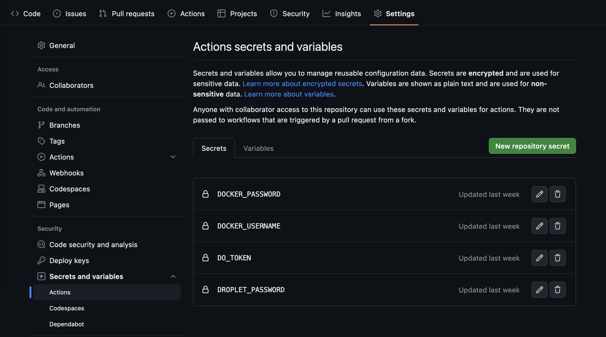
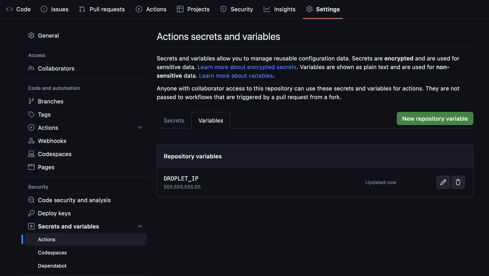

# Stage 2

__Overview__

You now have a functioning app however it only runs on your local machine. In this stage we will go through the process of deploying your app so you can show it off to others! We will also setup continuous integration to prevent new code changes from breaking your app.

## CI/CD Tools

There are the tools we'll be using to setup CI/CD.

### Github Actions

[GitHib Actions](https://docs.github.com/en/actions) allow you to execute arbitrary workflows by simply adding a `YAML` file to your repository.

Here is a great overview video: https://youtu.be/eB0nUzAI7M8

### Docker

[Docker](https://www.docker.com/) is a platform for building, running, and shipping applications in containers. 

Containerization is a technology that allows developers to package an application with all of its dependencies into a standardized unit, called a container, which can be easily deployed across different environments, including local machines, data centers, and cloud providers. Containers are lightweight, portable, and secure, enabling teams to build and deploy applications faster and more reliably.

Docker images are the blueprints or templates used to create Docker containers. An image contains all the necessary files, libraries, and dependencies required to run an application. A container, on the other hand, is a running instance of an image. It's a lightweight, isolated environment that runs the application and its dependencies. Multiple containers can be created from the same image, each with its own unique state and running independently.

Here is a great overview video: https://youtu.be/Gjnup-PuquQ

### DigitalOcean

[DigitalOcean](https://www.digitalocean.com/) is a cloud computing platform that provides virtual servers (called "Droplets") and other infrastructure services to developers and businesses. It offers a simple and intuitive user interface, along with flexible pricing plans that allow users to pay only for what they use. DigitalOcean supports a wide range of operating systems and application stacks, making it a popular choice for hosting web applications, databases, and other workloads.

Here are 2 great overview videos: https://youtu.be/goiq9PZLlEU & https://youtu.be/HODYl1KffDE

## Steps

### Step 1

__Configuring Docker__

Follow these steps to setup Docker:

1. Create an account on [Docker Hub](https://hub.docker.com/). This is where we will push our images.
2. Install Docker Desktop: https://docs.docker.com/get-docker/
3. Launch Docker Desktop
4. Copy over `.dockerignore`, `Dockerfile-auth`, `Dockerfile-health`, and `docker-compose.yaml` to your repository.
5. Inside `docker-compose.yaml` replace "letsgetrusty" with your Docker Hub username.

__File overview__

`.dockerignore`

Similar to `.gitignore` this tells Docker which files/directories it should ignore.

---

`Dockerfile-auth` & `Dockerfile-health`

These are the Docker files for our two services. 

A Dockerfile is a script that contains instructions to build a Docker image. It specifies the base image to use, adds application code, and sets up configuration options. By running a Dockerfile, developers can automate the creation of Docker images, making it easier to deploy and scale applications.

Let's take a look at the contents of `Dockerfile-auth`:

```docker
FROM rust:1.68.2-alpine3.17 AS chef
```

We start with the official Rust image which has all the dependencies we need to build a Rust project.

```docker
RUN apk add --no-cache musl-dev & cargo install cargo-chef
```

Then we install `musl-dev` and [cargo-chef](https://crates.io/crates/cargo-chef). [musl](https://musl.libc.org/) is an implementation of the C standard library built on top of the Linux system call API. [We need it for `cargo-chef` to work](https://github.com/LukeMathWalker/cargo-chef/blob/5f791e86e87db5bf3add5be5a91e0d06b03c42b4/docker/Dockerfile#L6). `cargo-chef` allows us to cache dependencies in our Rust project and speed up your Docker builds.

```docker
FROM chef AS planner
COPY . .
RUN cargo chef prepare --recipe-path recipe.json

FROM chef AS builder
COPY --from=planner /rust-bootcamp-microservices/recipe.json recipe.json
# Build dependencies - this is the caching Docker layer!
RUN cargo chef cook --release --recipe-path recipe.json
# Build application
RUN apk add --no-cache protoc
COPY . .
RUN cargo build --release --bin auth
```

Then we run `cargo-chef`, install `protoc`, and build the service  in release mode.

```docker
FROM debian:buster-slim AS runtime
WORKDIR /rust-bootcamp-microservices
COPY --from=builder /rust-bootcamp-microservices/target/release/auth /usr/local/bin
ENTRYPOINT ["/usr/local/bin/auth"]
```

Finally we create a new bare-bones image, copy over the binary we created in the previous step, and execute it! One of the advantages of Rust is that our apps can be compiled down to a single binary.

---

`docker-compose.yaml`

[Docker Compose](https://docs.docker.com/compose/) is a tool for defining and running multi-container Docker applications. With Compose, you use a YAML file to configure your application’s services. A service is a high-level concept that refers to a set of containers running the same image. Then, with a single command, you create and start all the services from your configuration.

In our case we need to define an auth service and a health check service:

```yaml
version: "3.9"
services:
  health-check:
    image: letsgetrusty/health-check # specify name of image on Docker Hub
    build: # specify which Docker file to use
      context: .
      dockerfile: Dockerfile-health
    restart: "always" # automatically restart container when server crashes
    depends_on: # ensure that `health-check` starts after `auth` is running
      auth:
        condition: service_started
  auth:
    image: letsgetrusty/auth # specify name of image on Docker Hub
    build: # specify which Docker file to use
      context: .
      dockerfile: Dockerfile-auth
    restart: "always" # automatically restart container when server crashes
    ports:
      - "50051:50051" # expose port 50051 so that applications outside the container can connect to it 
```

---

After completing the steps above you should be able to start your application via Docker Compose.

Run `docker-compose up` in the root of your project directory.

You should see console log output from both services in your terminal.

Press `CTRL-C` in your terminal window to stop the services.

Congratulations, you've Dockerized your app and are now ready to deploy it!

### Step 2

__Setting up continuous integration__

Before we talk about continuous deployment let's setup continuous integration. 

Specifically, we will add a GitHub Actions workflow that builds and tests your code before it is merged into master.

Copy over the `.github/workflow/prod.yml` file to your repository. 

This file defines the workflow. Let's go through it:

```yaml
on:
  push:
    branches:
      - master
   pull_request:
    branches:
      - master
```

First we define when we want our workflow to run. In this case we want to run the workflow whenever code gets pushed to master or when a pull request targeting the master branch is created.

```yaml
jobs:
  build:
    runs-on: ubuntu-latest

    steps:
    - name: Install protoc
      uses: arduino/setup-protoc@v1

    - name: Checkout code
      uses: actions/checkout@v2
```

Then we define each step in our `build` job. First we install protoc and checkout the source code.

```yaml
    - name: Cache dependencies
      uses: actions/cache@v3
      with:
        path: |
          ~/.cargo
          target/
        key: ${{ runner.os }}-cargo-${{ hashFiles('**/Cargo.lock') }}
        restore-keys: ${{ runner.os }}-cargo-
```

Then we use the cache action to cache the `/.cargo` and `target/` directories. This will decrease compile times between runs.

```yaml
    - name: Install Rust
      uses: actions-rs/toolchain@v1
      with:
        profile: minimal
        toolchain: stable

    - name: Build and test code
      run: |
        cargo build --verbose
        cargo test --verbose
```

Finally we build and test the app.

---


After adding `.github/workflow/prod.yml` to your repository and pushing the changes up to master, you should see your workflow execute.

### Step 3 (Optional)

__Setting up continuous deployment__

To setup continuous deployment follow these steps:

1. Create an AWS account: https://aws.amazon.com/

2. Create an AWS EC2 instance. Follow these steps (*Make sure to use `Password` as the authentication method!*):

    - Go to the EC2 Dashboard in the AWS Management Console
    - Click "Launch Instance"
    - __Name:__ rust-bootcamp-microservices
    - __Application and OS Images:__ Ubuntu Server 22.04 LTS (HVM), SSD Volume Type
    - __Instance type:__ t2.micro
    - __Key pair:__ Create new key pair or proceed without a key pair
    - __Network settings:__ 
        - Create security group or use existing
        - Allow SSH traffic from anywhere (0.0.0.0/0)
        - Add custom TCP rule for port 50051 from anywhere (0.0.0.0/0)
    - __Configure storage:__ 8 GiB gp2
    - __Advanced details:__ 
        - User data (add this script to set up password authentication):
        ```bash
        #!/bin/bash
        echo 'ubuntu:YourPasswordHere' | chpasswd
        sed -i 's/PasswordAuthentication no/PasswordAuthentication yes/' /etc/ssh/sshd_config
        sed -i 's/#PasswordAuthentication yes/PasswordAuthentication yes/' /etc/ssh/sshd_config
        systemctl restart sshd
        ```
        Replace `YourPasswordHere` with a secure password.
    - Click "Launch instance"
    ---
    __NOTE:__ Make sure to save the instance password you set in the user data script. We will use it in following steps. Also note down the public IP address of your instance.

3. Configure EC2 instance

    Now you should have a machine in the cloud (EC2 instance) which you can deploy to. Next we'll configure that instance by following these steps:

    **SSH Connection:**
    
    First, try to SSH into your EC2 instance:
    ```bash
    ssh ubuntu@YOUR_EC2_PUBLIC_IP
    ```

    **If SSH connection fails with "Permission denied (publickey)":**
    
    The User data script may not have executed properly. Use EC2 Instance Connect to fix it:
    
    1. Go to your AWS EC2 Console
    2. Select your instance and click "Connect"
    3. Choose "EC2 Instance Connect" (browser-based SSH)
    4. Click "Connect" to open a terminal in your browser
    5. Run these commands to manually set up password authentication:

    ```bash
    # Set password for ubuntu user
    sudo passwd ubuntu
    # (enter your desired secure password when prompted)

    # Edit SSH configuration
    sudo nano /etc/ssh/sshd_config
    ```

    6. In the editor, find and modify these lines (uncomment and set as shown):
    ```
    PasswordAuthentication yes
    PubkeyAuthentication no
    ChallengeResponseAuthentication yes
    UsePAM yes
    ```

    7. Save the file (Ctrl+X, then Y, then Enter in nano)

    8. Restart SSH service:
    ```bash
    sudo systemctl restart ssh
    ```

    9. Now try SSH from your local machine:
    ```bash
    ssh ubuntu@YOUR_EC2_PUBLIC_IP
    ```
    
    It should prompt for the password you just set.

    **Install Docker and Docker Compose:**
    
    Once connected to your instance, install docker and docker compose:

    ```bash
    sudo apt-get update
    sudo apt-get install docker.io
    sudo apt-get install docker-compose
    sudo usermod -aG docker ubuntu
    ```

    **Important:** Log out and log back in for Docker group membership to take effect:
    ```bash
    exit
    ssh ubuntu@YOUR_EC2_PUBLIC_IP
    ```

    **Test Docker installation:**
    ```bash
    docker --version
    docker-compose --version
    ```

4. Fix Docker compatibility issues

    Before updating the GitHub workflow, we need to fix compatibility issues with older Docker versions on EC2:

    **Update `docker-compose.yaml`** - Remove the `platforms` section that's not supported by older Docker Compose:
    ```yaml
    services:
      health-check:
        build:
          context: .
          dockerfile: Dockerfile-health
          # Remove platforms section
        restart: "always"
        depends_on:
          auth:
            condition: service_started
      auth:
        build:
          context: .
          dockerfile: Dockerfile-auth
          # Remove platforms section
        restart: "always"
        ports:
          - "50051:50051"
    ```

    **Update both `Dockerfile-auth` and `Dockerfile-health`** - Remove `--platform=$BUILDPLATFORM` flags:
    ```dockerfile
    # Change from:
    FROM --platform=$BUILDPLATFORM rust:1.88.0-alpine3.22 AS chef
    FROM --platform=$BUILDPLATFORM debian:buster-slim AS runtime
    
    # To:
    FROM rust:1.88.0-alpine3.22 AS chef
    FROM debian:buster-slim AS runtime
    ```

5. Update GitHub workflow

    Update your `.github/workflows/prod.yml` file to deploy using local building (no Docker Hub needed). The workflow now only runs when changes are pushed to master (not on PRs).

    ```yaml
    name: Build & Test

    on:
      push:
        branches:
          - master

    jobs:
      build:
        runs-on: ubuntu-latest
        steps:
          - name: Checkout code
            uses: actions/checkout@v4
          - name: Install protoc
            uses: arduino/setup-protoc@v3
          - name: Install Rust
            uses: dtolnay/rust-toolchain@stable
          - name: Cache dependencies
            uses: actions/cache@v4
            with:
              path: |
                ~/.cargo
                target/
              key: ${{ runner.os }}-cargo-${{ hashFiles('**/Cargo.lock') }}
              restore-keys: ${{ runner.os }}-cargo-
          - name: Build and test code
            run: |
              cargo build --verbose
              cargo test --verbose

      deploy:
        needs: build
        runs-on: ubuntu-latest
        steps:
          - name: Checkout code
            uses: actions/checkout@v4
          - name: Install sshpass
            run: sudo apt-get install sshpass
          - name: Copy project files to EC2
            run: |
              sshpass -p '${{ secrets.EC2_PASSWORD }}' scp -o StrictHostKeyChecking=no -r \
                Dockerfile-auth Dockerfile-health docker-compose.yaml proto src Cargo.toml build.rs \
                ubuntu@${{ vars.EC2_IP }}:~/rust-app/
          - name: Deploy on EC2
            run: |
              sshpass -p '${{ secrets.EC2_PASSWORD }}' ssh -o StrictHostKeyChecking=no ubuntu@${{ vars.EC2_IP }} '
                cd ~/rust-app &&
                docker-compose down &&
                docker-compose build &&
                docker-compose up -d
              '
    ```

    This approach:
    - Copies source code to EC2 instead of using Docker Hub
    - Builds Docker images directly on the server
    - Simpler setup with no external registries needed

6. Update Github Secrets & Variables

    The workflow uses two variables: `secrets.EC2_PASSWORD` and `vars.EC2_IP`. These need to be defined in your GitHub repository.

    **Add required secrets:**
    1. Navigate to your repository on https://github.com/
    2. Click on the `Settings` tab
    3. In the left side-panel click `Secrets and variables` underneath the `Security` section and then click `Actions`.
    4. Add the following secret:
      - `EC2_PASSWORD` - The password you set for the ubuntu user during EC2 setup
    
        

    **Add required variables:**
    1. Click on the `Variables` tab in GitHub
    2. Create a new variable called `EC2_IP` and set the value to your EC2 instance's public IP address.

        

    After adding these, you can push changes to the `master` branch and they will automatically deploy to your EC2 instance.

7. Check EC2 instance

    After the GitHub workflow finishes deploying your project, check that your app is running:

    1. SSH into your EC2 instance: `ssh ubuntu@YOUR_EC2_PUBLIC_IP`
    2. Run `docker ps` to see which containers are up

        You should see 2 containers running. Example output:

        ```bash
        ubuntu@ip-172-31-23-14:~$ docker ps
        CONTAINER ID   IMAGE                COMMAND                  CREATED      STATUS        PORTS                                           NAMES
        8805358e487d   rust-app_health-check "/usr/local/bin/heal…"   4 days ago   Up 4 days                                                     rust-app_health-check_1
        a18f0935f7bb   rust-app_auth        "/usr/local/bin/auth"    4 days ago   Up 17 hours   0.0.0.0:50051->50051/tcp, :::50051->50051/tcp   rust-app_auth_1
        ```

8. Test your deployed application

    Use your local client to connect to the auth service running in your EC2 instance.

    **Create a new user:**
    ```bash
    AUTH_SERVICE_IP=YOUR_EC2_PUBLIC_IP cargo run --bin client -- sign-up --username testuser --password mypassword
    ```

    You should see: `SignUpResponse { status_code: Success }`

    **Sign in:**
    ```bash
    AUTH_SERVICE_IP=YOUR_EC2_PUBLIC_IP cargo run --bin client -- sign-in --username testuser --password mypassword
    ```

    You should see something like:
    ```
    SignInResponse { 
      status_code: Success, 
      user_uuid: "f6fd102e-bc8d-4c8d-94c9-5a9dd1bafb69", 
      session_token: "e17bd9c1-ef33-4504-8c85-f0cd194fb1d6" 
    }
    ```

    **Sign out (using the session token from sign-in):**
    ```bash
    AUTH_SERVICE_IP=YOUR_EC2_PUBLIC_IP cargo run --bin client -- sign-out --session-token YOUR_SESSION_TOKEN
    ```

    You should see: `SignOutResponse { status_code: Success }`

    Replace `YOUR_EC2_PUBLIC_IP` with your EC2 instance's public IP address.

### Step 3 Alternative - Railway Deployment

__Setting up continuous deployment with Railway__

***
THIS IS A SIMPLER ALTERNATIVE TO THE AWS EC2 APPROACH ABOVE. RAILWAY OFFERS A FREE TIER THAT'S PERFECT FOR TESTING.
***

**Important gRPC Limitation:** Railway's load balancers do not properly support external gRPC connections. You may experience "broken pipe" or connection errors when trying to connect your client directly to the deployed auth service. Railway's internal networking (service-to-service communication) works fine for gRPC, but external clients connecting through Railway's public URLs may face issues. For production gRPC applications, consider using a different service provider or implementing gRPC-Web for browser compatibility.

Railway is a Platform-as-a-Service that automatically deploys your Docker applications with minimal configuration.

**Steps:**

1. **Create Railway Account**
   - Go to https://railway.app/
   - Sign up with your GitHub account

2. **Create Railway Configuration Files**
   
   Railway needs specific configuration files to properly deploy Docker-based microservices. Create these files in your project root:
   
   **Create `railway.json` for the auth service:**
   ```json
   {
     "$schema": "https://railway.app/railway.schema.json",
     "build": {
       "builder": "DOCKERFILE",
       "dockerfilePath": "Dockerfile-auth"
     },
     "deploy": {
       "startCommand": "/usr/local/bin/auth",
       "restartPolicyType": "ON_FAILURE",
       "restartPolicyMaxRetries": 10
     }
   }
   ```
   
   **Create `railway-health.json` for the health-check service:**
   ```json
   {
     "$schema": "https://railway.app/railway.schema.json",
     "build": {
       "builder": "DOCKERFILE",
       "dockerfilePath": "Dockerfile-health"
     },
     "deploy": {
       "startCommand": "/usr/local/bin/health-check",
       "restartPolicyType": "ON_FAILURE",
       "restartPolicyMaxRetries": 10
     }
   }
   ```

3. **Deploy the Auth Service**
   - Click "New Project" in Railway dashboard
   - Select "Deploy from GitHub repo"
   - Choose your rust-bootcamp-microservices repository
   - Railway will use the `railway.json` file to deploy the auth service with Docker
   - Wait for the deployment to complete and note the service URL

4. **Deploy the Health-Check Service**
   - In the same Railway project, click "New Service"
   - Select "GitHub Repo" and choose the same repository
   - In the service settings, specify `railway-health.json` as the configuration file
   - Railway will deploy the health-check service as a separate container

5. **Configure Inter-Service Communication**
   
   The health-check service needs to communicate with the auth service using Railway's internal networking:
   
   - Go to your **health-check service** in Railway dashboard
   - Click on the "Variables" tab
   - Add a new environment variable:
     - **Name:** `AUTH_SERVICE_HOST_NAME`
     - **Value:** `your-auth-service-name.railway.internal` (use the internal Railway URL)
   
   Railway's internal networking automatically handles port mapping and service discovery between services in the same project.

---

## Final Note

Congratulations! You have built fully functioning microservices app in Rust!

You should be proud of your progress if you've gotten this far.

Showcase your implementation and struggles you've faced along the way to others in the Let's Get Rusty community.

More importantly, teaching is the best way to learn. Any questions posted by others in the Discord channels are opportunities for you to answer and truly internalize your knowledge.
